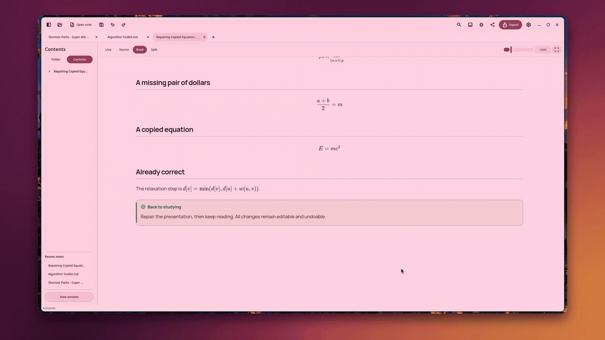
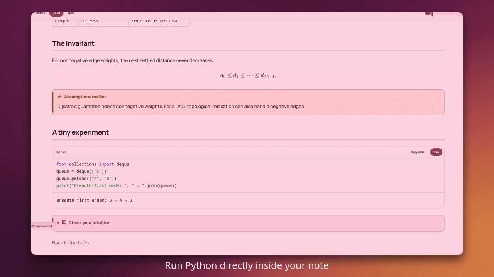
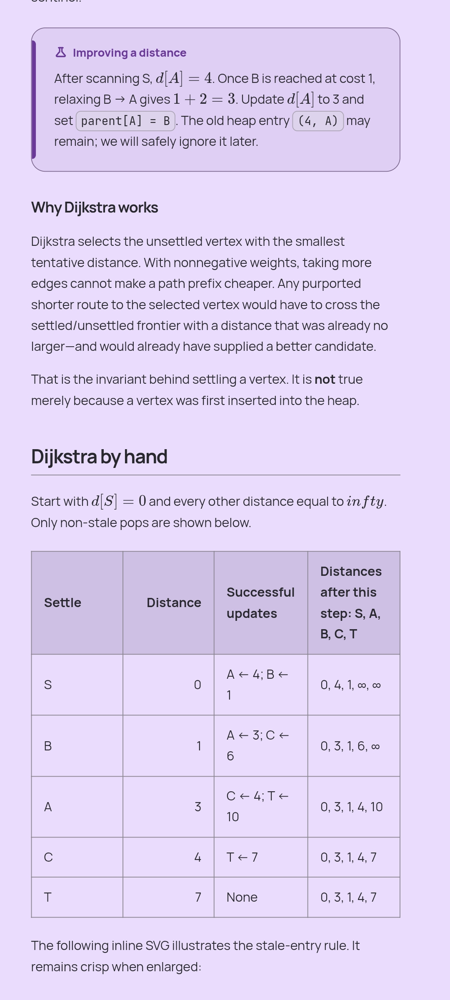
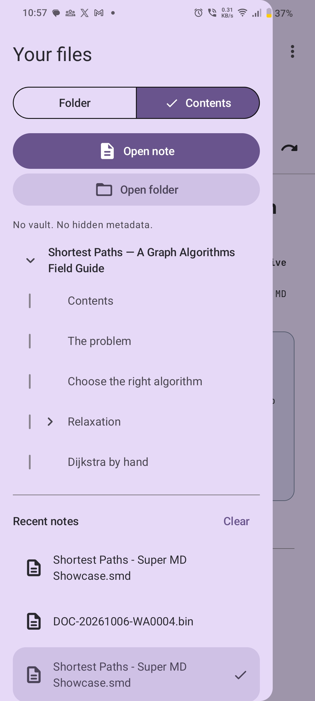
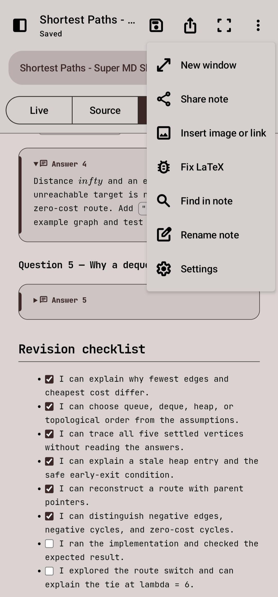

<p align="center">
  
</p>

<h1 align="center">Super MD</h1>

<p align="center">
  Your notes. More possibilities.<br>
  A native Markdown workspace for reading, writing, and learning.
</p>

<p align="center">
  <a href="https://github.com/YashMahawa/super-md/releases/latest">Download</a> ·
  <a href="#see-it-in-action">Demo</a> ·
  <a href="docs/AUTHORING.md">Authoring guide</a> ·
  <a href="#build-and-contribute">Build from source</a> ·
  <a href="LICENSE">MIT License</a>
</p>

Super MD brings expressive native controls, focused reading, and interactive study tools to ordinary Markdown. Open a file or folder and get started—no vault, import process, account, or proprietary note database.

Write in `.md`. Carry a note and its images together in `.smd`. Export a properly typeset PDF when it is time to share.

## See it in action

https://github.com/user-attachments/assets/471e6025-3ce8-4daf-ba2b-ee66b53b006a

**[Watch or download the walkthrough](https://github.com/user-attachments/assets/471e6025-3ce8-4daf-ba2b-ee66b53b006a)** — 2 minutes 39 seconds, 1440p, with narration. Explore themes, fonts, reading modes, images, interactive graphs, search, Python, PDF options, LaTeX repair, and independent windows.

### A workspace that moves with you

Hold and drag to reorder tabs, move a note between desktop windows, or detach it into a new window. Bring it back without losing the note's assets or editing state. Moving the last tab out retires the empty window.



### Notes that can run the example

Execute trusted Python cells directly from the note. A single code container keeps Copy, Run, and the result together. NumPy and Matplotlib support worked examples and generated figures, including static 3D plots.



Code runs only when you press **Run**, never when opening a note or exporting it. A separate worker is not a security sandbox; run only code you trust.

### The same notes on Android

Native Material 3 Expressive controls, a compact phone workspace, and layouts that adapt to larger Android windows. Open ordinary files or a self-contained SMD note, then navigate and study without a desktop-sized interface squeezed onto a phone.

<table>
  <tr>
    <td width="33%" align="center"><strong>Focused reading</strong></td>
    <td width="33%" align="center"><strong>A navigable outline</strong></td>
    <td width="33%" align="center"><strong>Tools within reach</strong></td>
  </tr>
  <tr>
    <td valign="top"><a href="docs/media/android-reading.jpg"></a></td>
    <td valign="top"><a href="docs/media/android-outline.jpg"></a></td>
    <td valign="top"><a href="docs/media/android-note-tools.jpg"></a></td>
  </tr>
</table>

## More than a Markdown reader

### Native controls, considered appearance

- **Expressive Material styling:** rounded controls, coordinated semantic colors, clear selected states, purposeful motion, and a motion-off setting.
- **Your theme, your paper:** system colors or chosen accents; tinted light, dark, and pure-black themes; separate fullscreen appearance.
- **Typography you can choose:** searchable font selection, private TTF/OTF imports, and bundled Manrope, Roboto, Noto Sans, Noto Serif, and JetBrains Mono. Imported fonts can also be used for PDF export.
- **A layout that fits:** percentage-based reading width, adjustable text size and vertical spacing, and settings that persist across sessions.

Desktop uses native Qt Quick/QML controls; Android uses native Kotlin/Jetpack Compose Material 3 Expressive. Both share the document engine. The desktop document pane uses Qt WebEngine and Android uses the system WebView; the app is not an Electron or Tauri desktop host.

### Reading without the surrounding noise

- **Distraction-free fullscreen** with a compact overlay bar and controls that hide while reading. Desktop supports F11 and Escape.
- **Page-style zoom:** magnify the document without scaling the toolbar or repeatedly rewrapping paragraphs. Pinch or use content-zoom controls; pan a magnified page with two-finger movement.
- **Independent image viewing:** open an image, zoom toward a point, and pan it without changing the note's text size.
- **An automatic contents outline:** headings become a collapsible, scrollable navigation tree—even when the note has no handwritten contents links. Fullscreen can show the outline as an overlay.
- **Find in the rendered note:** highlighted matches, directional navigation, case matching, and Source-mode replacement. Internal heading links and existing wiki-style heading links are understood.
- **Source-aware copying:** copy Markdown and LaTeX from reading content; code blocks have their own Copy control.

### Writing, editing, and recovery

- **Live, Source, Read, and Split:** read comfortably, edit Markdown directly, or compare source and output. Split is available on desktop and sufficiently large Android windows.
- **Block editing in Live mode:** double-click a block to edit, scroll within the editor, and leave with an outside click or Escape.
- **Everyday file tools:** open and close folders, rename notes, hover file-path hints on desktop, recent notes, and system file/folder pickers.
- **Undo and redo:** UI controls and keyboard shortcuts. Existing notes autosave by default, drafts recover across restarts, and empty untitled notes are discarded.
- **Images without ceremony:** paste, pick, or drag and drop; replace or remove an image; insert links with readable titles and optional video thumbnails.
- **Writing assistance:** optional offline English spelling and basic grammar suggestions, excluding code, links, and math. Suggestions do not upload or automatically rewrite note text.

### Repair copied LaTeX—with a review, not a blind rewrite

**Fix LaTeX** finds repairable issues such as missing math delimiters, alternate enclosing forms, unfinished fences, and selected brace or environment mistakes. Review the proposed source changes, select what to apply, and undo afterward if needed.

The same repair logic runs on desktop and Android. Code, URLs, currency, and already-valid math are protected. Ambiguous prose, unsupported commands, and arbitrary TeX macros are not guessed. See the [math repair and gesture guide](docs/GESTURES-AND-MATH-REPAIR.md).

### Study tools inside the document

- **Math and technical notes:** inline and display LaTeX, syntax-highlighted code, GFM tables, task checkboxes, links, and Unicode text.
- **Callouts with clear visual identity:** notes, tips, questions, warnings, examples, and solutions, with themed surfaces and matching icons.
- **Answer reveal and code folding:** hide a worked answer until you are ready; collapse long code without removing it from the note or PDF.
- **Diagrams and figures:** Mermaid, inline SVG, relative images, and figures produced by explicitly run Python cells.
- **Interactive 2D graphs:** multiple colored curves, parameter sliders, focal zoom and pan, an optional grid, and coordinate probing within the graph canvas. Graph interaction stays separate from document zoom.
- **Local Python:** choose an interpreter or virtual environment on desktop; Android includes Python, NumPy, and Matplotlib in an app-owned worker. Static Matplotlib 3D figures remain supported; interactive 3D charts are not included.

### PDFs built for the page, not the browser DOM

PDF export uses an embedded **Rust / Typst / MiTeX typesetting engine**, not a browser print dialog or a screenshot of the document DOM. It lays out text, math, and tables for the chosen paper size independently of the reading pane.

- Paper sizes, margins, document font, type size, line and paragraph spacing, and optional page numbers.
- Optional light Material-themed paper; off by default. Colored callouts remain meaningful in the standard export too.
- Wrapping, paginated tables with repeated headers; equations fitted to the available width.
- Clickable internal heading destinations and PDF outline navigation.
- Prepared Mermaid/SVG diagrams, embedded or local images, current chart values, and figures from Python cells you have run.
- The same remembered PDF options for **Export** and **Share**, rather than separate settings to keep in sync.

Typesetting works offline without an external Typst installation or browser print layout. Math support is not a full TeX distribution: unsupported constructs produce a visible error rather than a silently incomplete PDF. Graphs are exported as static figures; code is never run implicitly.

### Portable files, not a locked-in library

| Format | Use it for |
|---|---|
| `.md` | Ordinary UTF-8 Markdown, with companion assets where needed |
| `.smd` | One editable, shareable file containing Markdown and image assets |
| `.pdf` | A typeset document with static figures and navigable headings |

Legacy portable `.fmd` and older text `.smd` notes remain readable. Portable assets never become a wall of binary data in the Source editor. Export and platform sharing handlers make it easy to move notes without signing into a service.

The binary-safe **CLI** exposes bounded Markdown reads, metadata, and individual assets separately—useful for scripts and AI agents. It never downloads images or executes note code implicitly.

```sh
smd-engine inspect lesson.smd
smd-engine read lesson.smd --offset 0 --limit 16000
smd-engine assets lesson.smd
smd-engine extract lesson.smd assets/figure.svg figure.svg
smd-engine pack lesson.md lesson.smd
smd-engine export lesson.smd lesson.pdf
```

See the [authoring guide](docs/AUTHORING.md) for supported syntax, runnable examples, portable-file limits, and GUI versus headless export capabilities.

### Built around local work

Notes stay local. Folder access uses operating-system permissions, remote-image loading requires consent, and update checks can be disabled. Viewport-aware document rendering, bounded caches, and background workers are designed to keep large notes responsive without making a second note database. See [large-note performance](docs/LARGE-NOTE-PERFORMANCE.md) for implementation details and limits.

Android supports independent app windows and drag-reordering tabs where the device permits it; wider windows can use Split mode and foldable-aware layouts. Desktop adds drag transfer between windows. See [platform behavior](docs/PLATFORM-PARITY.md) for the differences rather than assuming identical operating-system capabilities.

## Download

Get **[Super MD 0.5.1](https://github.com/YashMahawa/super-md/releases/tag/v0.5.1)** or visit the [latest release](https://github.com/YashMahawa/super-md/releases/latest).

| Platform | Packages |
|---|---|
| Linux x86-64 | [AppImage](https://github.com/YashMahawa/super-md/releases/download/v0.5.1/Super-MD_0.5.1_amd64.AppImage) · [DEB](https://github.com/YashMahawa/super-md/releases/download/v0.5.1/Super-MD_0.5.1_amd64.deb) · [RPM](https://github.com/YashMahawa/super-md/releases/download/v0.5.1/Super-MD-0.5.1-1.x86_64.rpm) |
| Windows x64 | [Installer](https://github.com/YashMahawa/super-md/releases/download/v0.5.1/Super-MD_0.5.1_x64-setup.exe) |
| macOS Apple silicon | [DMG](https://github.com/YashMahawa/super-md/releases/download/v0.5.1/Super-MD_0.5.1_aarch64.dmg) |
| macOS Intel | [DMG](https://github.com/YashMahawa/super-md/releases/download/v0.5.1/Super-MD_0.5.1_x64.dmg) |
| Android 8+ / ARM64 | [Signed release APK](https://github.com/YashMahawa/super-md/releases/download/v0.5.1/Super-MD-0.5.1-arm64-release.apk) |

Release checksums are included. macOS packages are ad-hoc signed, not notarized; Windows installers are not code-signed. Android installation requires the normal system approval. For Linux graphics or AppImage mounting issues, read [graphics diagnostics](docs/GRAPHICS-DIAGNOSTICS.md).

Settings includes the installed version, update checks, and optional automatic downloads. Updates are verified before becoming installable; installation remains your choice. See [update behavior](docs/UPDATES.md).

## Build and contribute

The project combines a shared React / TypeScript document renderer with native Qt Quick and Android Compose shells, plus the Rust PDF and portable-file engine. The desktop shell does not depend on the legacy Electron or Tauri hosts retained in the repository.

Start with the [development guide](docs/DEVELOPMENT.md), [note format](FORMAT.md), and [authoring reference](docs/AUTHORING.md). Changes to shared rendering should be checked on desktop and Android; changes to PDF preparation should also cover the native engine.

<details>
<summary>Desktop quick start</summary>

Node 20+, Rust stable, and Python 3.13 are required. Install the pinned desktop dependencies into a virtual environment.

```sh
npm ci
python -m venv desktop/.venv
desktop/.venv/bin/python -m pip install -r desktop/requirements-build.txt
npm run build
cargo build --locked --release --manifest-path smd-core/Cargo.toml --bin smd-engine
desktop/.venv/bin/python desktop/main.py
```

</details>

<details>
<summary>Useful desktop shortcuts</summary>

Use Ctrl on Linux/Windows and Command on macOS where supported.

| Shortcut | Action |
|---|---|
| Ctrl/Command+N | New tab |
| Ctrl/Command+W | Close tab |
| Ctrl/Command+Shift+T | Reopen closed tab |
| Ctrl/Command+Tab | Next tab |
| Ctrl/Command+O / S / Shift+S | Open / Save / Save as |
| Ctrl/Command+Shift+O | Open folder |
| Ctrl/Command+B | Toggle sidebar |
| Ctrl/Command+F | Find; Source also supports replace |
| Ctrl/Command+Z / Y | Undo / Redo |
| Ctrl/Command++ / − / 0 | Content zoom / reset |
| Ctrl/Command+Shift+N | New window |
| F11 / Escape | Enter / leave fullscreen |

</details>

## License

Super MD's original code is available under the [MIT License](LICENSE). Bundled libraries, fonts, and icons retain their own licenses and notices. See [desktop distribution notices](desktop/NOTICE.md) and [third-party UI licenses](public/third-party-ui-licenses.txt).
