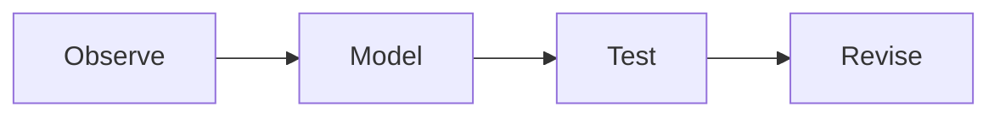

# Writing notes for Super MD and AI agents

This describes the current development source. Check the installed application's
version before assuming a new feature is in a published release.

## Files and portable images

Write ordinary notes as UTF-8 **`.md`**. Use normal Markdown, not vault metadata.
**`.smd`** is the portable format: Markdown and image assets in one editable file.
Super MD's source editor exposes its Markdown only, never a wall of image bytes.
The old `.fmd` envelope and older *plain-text* `.smd` notes remain readable.
Do not rename a plain Markdown file to `.smd` and claim its images are embedded.

An agent should create/edit `.md` and let the app or native engine pack it:

```sh
smd-engine pack ./lesson.md ./lesson.smd
smd-engine inspect ./lesson.smd
smd-engine read ./lesson.smd --offset 0 --limit 16000
smd-engine assets ./lesson.smd
smd-engine extract ./lesson.smd assets/image-1.svg ./figure.svg
```

`read` emits bounded Markdown, with continuation information on stderr. `inspect`
and `assets` emit metadata, not image bytes. `extract` writes one named image to a
file and refuses to overwrite an existing output. Avoid `cat lesson.smd` or
putting its JSON/base64 envelope in an AI's context. Use file/image tools on the
extracted asset separately. For edits, export or unpack the relevant images into
a working folder, edit Markdown, and pack a new portable note. The GUI handles
image insertion, drag/drop, replacement/removal and portable Save in-place.

The v1 portable envelope has `format: "supermd-smd"`, `version: 1`, `markdown` and
`assets`. Only the assets map holds base64 image data URLs. Names are bounded,
safe `assets/<filename>` references. Use the packer instead of synthesizing binary
JSON. Limits: 20 MB Markdown, 25 MB per image, 75 MB total images, 512 assets,
120 MB envelope. The CLI does not download URLs or auto-run Python.

## Markdown and navigation

Use clear headings, ordinary lists, GFM tables and fenced code. A portable TOC:

```md
## Contents
- [Conditional probability](#conditional-probability)
- [Worked example](#worked-example)

## Conditional probability
...
## Worked example
...
```

Heading fragments use lowercase words separated by hyphens, with punctuation
removed; repeated headings receive `-1`, `-2`, etc. Prefer distinctive headings.
Ordinary internal links also become clickable PDF destinations. Existing Obsidian
`[[#Heading|label]]` links are understood by the preview/export preparation;
ordinary Markdown links are preferable for new notes and headless CLI export.
The app supports existing `![[image.png]]` references, but new notes should use
``. Keep relative assets inside the note folder.

## LaTeX

Always preserve explicit delimiters, including text copied from AI responses:

```md
Inline: $P(A\mid B)=\frac{P(A\cap B)}{P(B)}$.

$$
\begin{aligned}
P(A\cup B\cup C) ={}& P(A)+P(B)+P(C)\\
&-P(A\cap B)-P(A\cap C)-P(B\cap C)\\
&+P(A\cap B\cap C).
\end{aligned}
$$
```

Put block delimiters on their own lines in new notes. Existing Obsidian same-line
`$$...$$` is also supported. Prefer `aligned`/`gathered` for long equations,
ordinary LaTeX (not custom macro packages), and concise table cells. Fix LaTeX
offers reviewable repairs for `\(...\)`, `\[...\]`, explicit environments and
obvious standalone formulas without delimiters. It cannot safely infer every
formula mixed into prose or distinguish all currency from inline math. An AI
should supply correct delimiters rather than depend on guessing.

## Callouts, answers and code folding

```md
> [!tip] First try
> Solve it before revealing the answer.

> [!answer]- Reveal the answer
> The answer includes $x^2$ and normal Markdown.

> [!solution]+ Worked solution (initially open)
> Show the intermediate steps here.
```

Types include note, tip, info, question, warning, danger, example, success, answer
and solution. `-` starts a collapsible box closed; `+` starts it open. Answer and
solution are collapsible by default. Other callout types can also use `+`/`-`.
Long code (over 12 lines) is initially folded in the app; its heading expands it.
Folding is a reading interaction, **not deletion**: PDF export keeps the contents.

## Interactive graphs: safe JSON, not arbitrary JavaScript

Use a fenced `smd-chart` block. A multi-color line plot with a parameter slider:

````md
```smd-chart
{
  "title": "Frequency and phase",
  "x": { "min": -6.28, "max": 6.28, "steps": 240, "label": "x (radians)" },
  "y": { "min": -1.2, "max": 1.2, "label": "Amplitude" },
  "series": [
    { "name": "Sine", "expression": "sin(a*x)", "color": "#006a6a" },
    { "name": "Cosine", "expression": "cos(a*x)", "color": "#6750a4" }
  ],
  "sliders": [
    { "name": "a", "label": "Frequency", "min": 0.1, "max": 3, "step": 0.05, "value": 1 }
  ]
}
```
````

Line series can instead contain finite `"points": [[0,0],[1,1],[2,4]]`. There are
up to 16 series, 16 sliders and 1,000 sampling steps; JSON is bounded to 500 KB.
Missing/undefined function samples break a curve instead of joining across a gap.
Use explicit y limits near poles/asymptotes. Colors are `#RRGGBB`.

Three-dimensional **wireframe surfaces** use two coordinates and up to four
series (not arbitrary 3D scenes or scripts):

````md
```smd-chart
{
  "mode": "surface3d",
  "title": "Bowl and saddle",
  "x": { "min": -2, "max": 2, "steps": 20 },
  "y": { "min": -2, "max": 2 },
  "z": { "label": "Height" },
  "series": [
    { "name": "Bowl", "expression": "a*(x^2+y^2)", "color": "#006a6a" },
    { "name": "Saddle", "expression": "x^2-y^2", "color": "#6750a4" }
  ],
  "sliders": [{ "name": "a", "min": 0.1, "max": 2, "value": 1 }]
}
```
````

The 3D grid defaults to 20 steps and is capped at 40. Orbit and tilt have sliders;
mouse drag rotates. Touch rotation is explicitly enabled so ordinary scrolling
doesn't become a graph gesture. Rotation is frame-coalesced; it does not re-evaluate
the mathematical grid. The current camera and parameter values are remembered
within the app session and used for the static vector PDF snapshot. A PDF cannot
retain sliders or a draggable camera.

Pinch or Ctrl/Meta + trackpad wheel over a plot changes only that plot's zoom
(50–800%), not the note's text size. The Plot zoom slider and Reset zoom provide
keyboard-accessible alternatives. Zoom is session state and is included in PDF
snapshots; it does not modify the Markdown or re-evaluate the mathematical grid.

Expressions accept `x`, `y` (surfaces), named slider variables, `pi`, `e`,
parentheses, `+ - * / % ^ **` and functions `sin cos tan asin acos atan sqrt abs
exp log log10 floor ceil round min max pow`. `log` is natural logarithm. Explicit
multiplication is required: `2*x`, not `2x`. `-x^2` means `-(x^2)`; `2^-2` is
valid. Existing `Math.sin`/`Math.PI` spelling is accepted. No property access,
JavaScript statements, network calls or eval. NaN, invalid ranges, malformed
arrays and unsupported expressions produce an error panel, not an app crash.

## Mermaid, SVG and Python

Mermaid uses fenced `mermaid` code:

````md

````

SVG can be an ordinary image or fenced `svg` XML. Supply a `viewBox`, explicit
dimensions and a self-contained vector image. No script, event handlers, embedded
HTML or external image/style dependencies. Mermaid/SVG export as vector images.

Fenced `python`/`py` code has an explicit Run button. Matplotlib is rendered with
the non-interactive Agg backend and captured as SVG:

````md
```python
import numpy as np
import matplotlib.pyplot as plt
x = np.linspace(-3, 3, 300)
fig, ax = plt.subplots()
ax.plot(x, x*x, label="Quadratic")
ax.set(xlabel="x", ylabel="f(x)")
ax.legend()
```
````

Desktop uses the configured system/venv Python with matplotlib installed; Android
uses its embedded Python environment. Local Python is **trusted code, not a
sandbox**. Do not run unknown generated code without review. Export never
auto-executes Python: successfully run cells include their source, text output
and figures; unrun cells remain source code. Changing the code invalidates the
old output. These plots are static figures, not live Python widgets.

## Links, images and export

Pasting a URL opens an insertion choice with an editable fetched title. Supported
YouTube links offer an optional thumbnail preview; insertion downloads the image
as a local asset. Image URLs can also be inserted explicitly. Remote pictures in
existing Markdown require loading/trust consent in the reader. Links remain
ordinary hyperlinks; this is not a video-player embed.

Clicking a rendered image opens an independent pan/zoom viewer. Its zoom does
not change the note's text size. Images can be selected for Replace/Remove with
an undo opportunity. File drag/drop support depends on the OS's file provider.

The native PDF engine is Typst with LaTeX conversion, not a DOM print operation.
It paginates tables and code, repeats table headers, fits wide equations, and
supports page-number toggling, paper size, margins, text size and embedded fonts.
Run a smoke export of unfamiliar LaTeX before treating it as a finished handout.
GUI export prepares Mermaid, charts and previously run Python output first.
Headless `smd-engine export lesson.md lesson.pdf` exports standard Markdown,
LaTeX and local images but does not run diagram/Python generation. Prepared
content/images/options may be passed to `export-json` through stdin by a tool;
keep those bytes out of the conversational context.

For an AI: produce `.md`, preserve exact math delimiters, use the schemas above,
never hide required assets outside the note folder, and use CLI text/asset
operations separately when working with `.smd`.
